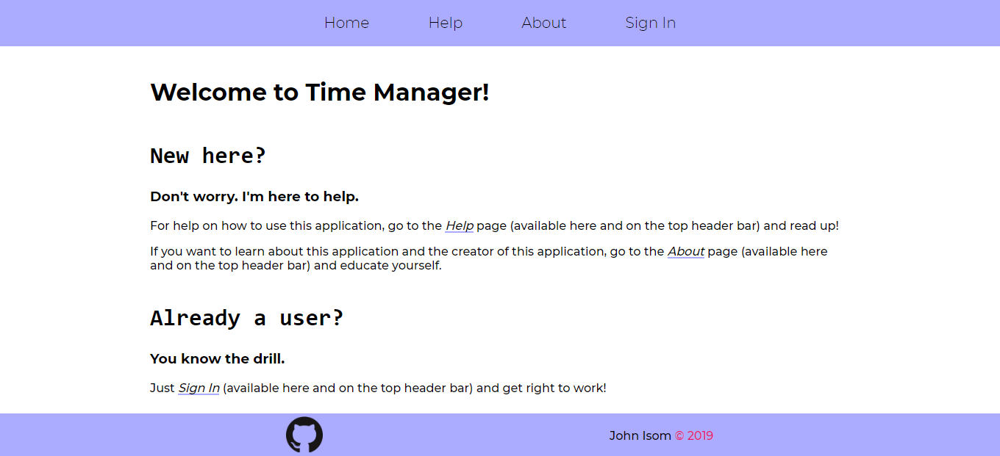
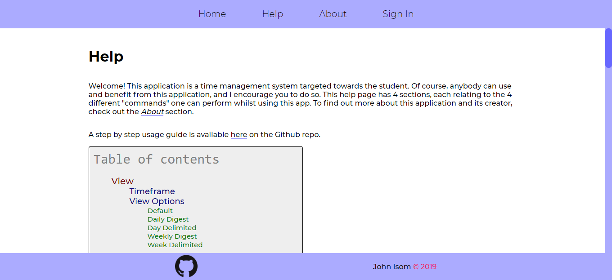
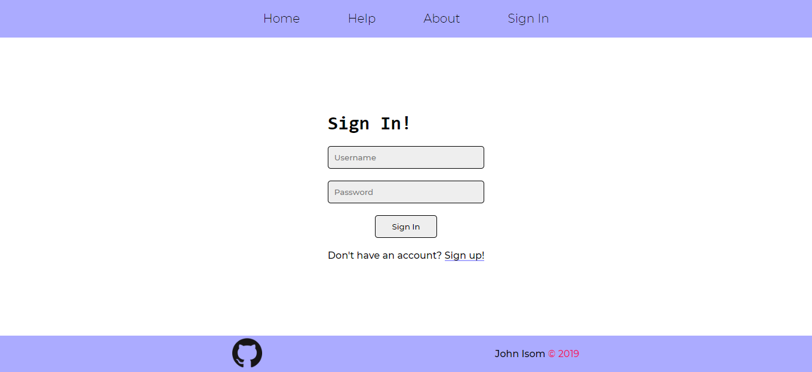
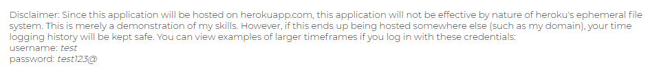
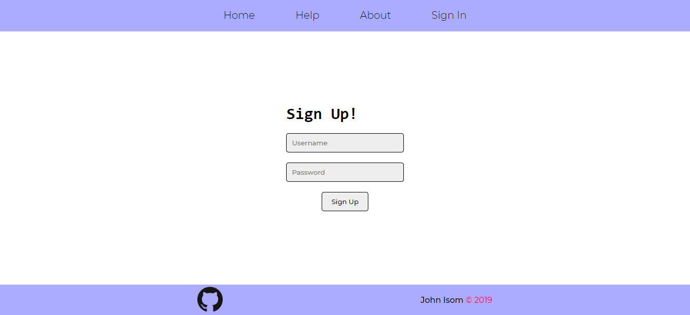
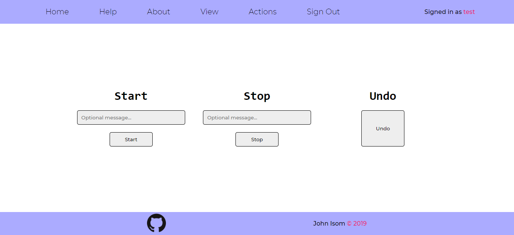
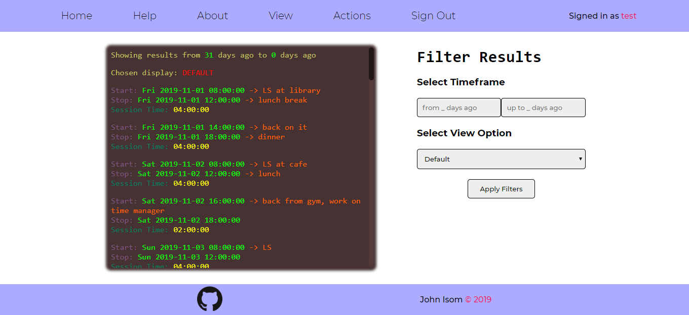
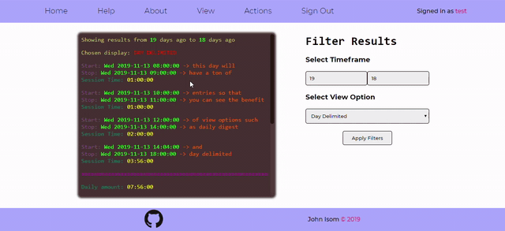
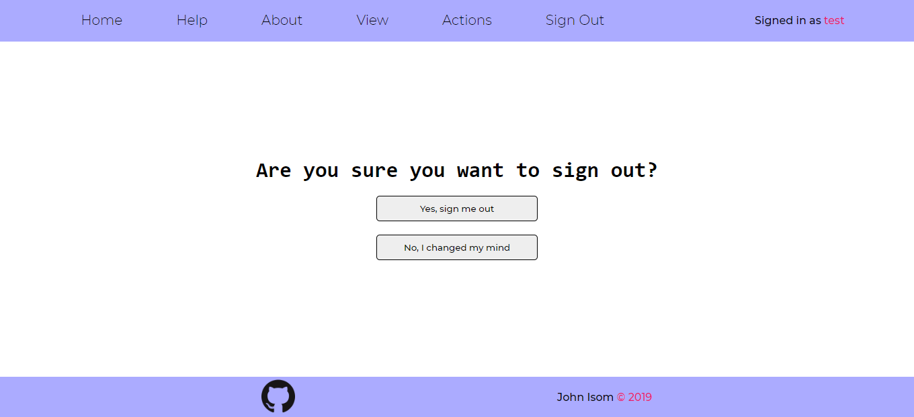

# Time Manager

Time Manager is a [Sinatra][sinatra] web application for tracking study/work time so that you know exactly how many of your precious hours are going to good use. The web app is hosted [here][time-manager] on Heroku and the Github repository is [here][github].

Inspiration for this app comes from a similar command-line application that I had previously made with Python. The Github repository for that little project can be found [here][python-tm].

This app was created as an optional project for [Launch School][ls]'s RB175 course. The two other optional projects I created are the games [Tic Tac Toe][ttt] and [Twenty-One][twenty-one].

## Usage

Additional help and instructions on how to use this application can be found on the [help section][help] of the app website.

### 1) Go To [The Time Manager][time-manager]

  

Here you'll find all the links and pages that you can access in your current state of being signed out,
as well as simple first time instructions on the home (current) page.

### 2) Go To The [Help Page][help]

  

Here you can read up on all of the different commands: what they do and how to use them.
It is suggested you read this whole section before using this application.

### 3) [Sign In][sign-in]

  

If you already have an account, you can just sign in here and get right to work. If you don't, you may
create one or use the test account that is free for everybody to use as explained in this disclaimer
at the bottom of the *About* section:

  

### 4) Or, Alternatively, [Sign Up][sign-up]

  

If you decide to use this application with your own user, it is very important that you are connected to
this application with HTTPS. You can verify this by looking at the URL field in your browser
to see that it has a lock icon and says that your connection is secure. If you view the whole URL
(you must double-click in Chrome, Firefox and Edge show by default), You will see something like this:

  

Once you have signed up, you will now see that your header has changed and has a few additional buttons, one
of which is highligthed in this screenshot:

  

### 5) Do An Action

  

This is the control terminal of the application. You can start your time, stop it, or undo the last start or stop that you did.
Get familiar with it. I suggest you read up on [Start][start], [Stop][stop], and [Undo][undo] on the [help][help] page.
Be careful with the actions that you commit here. Currently, there is no feature to edit a previously started/stopped time or message, only to delete the last entry, whether it was a start or a stop.

### 6) View Logged Time

  

This is by no doubt the heart of the application.
All your intelligent reporting is on this very page, where you can view within a specified timeframe with a selection of 5 different view options.
To be able to effectively use this section, read the [help][help] section on [View][view] where you can 
get sufficient help on the [Timeframe][timeframe] and [View Options][view-options] filters of viewing.

Here is an example with Timeframe set from *19* to *13* days ago with the view option of *Day Delimited*:

  

### 7) Sign Out (optional)

  

Once you've finished using the application, go ahead and sign out. While not mandantory, it is reccommended as your session will last the duration that Heorku's dyno is up and running, which is approximately a full day.

## Contributing
Send a pull request or open an issue.

Please also update tests to reflect those changes.

## License
[MIT](LICENSE) &copy; 2019

[sinatra]: http://sinatrarb.com/
[ttt]: http://just-a-tic-tac-toe-app.herokuapp.com/
[twenty-one]: http://just-a-twenty-one-app.herokuapp.com/
[time-manager]: https://the-time-manager.herokuapp.com/
[help]: https://the-time-manager.herokuapp.com/help
[start]: https://the-time-manager.herokuapp.com/help#start
[stop]: https://the-time-manager.herokuapp.com/help#stop
[undo]: https://the-time-manager.herokuapp.com/help#undo
[timeframe]: https://the-time-manager.herokuapp.com/help#timeframe
[view-options]: https://the-time-manager.herokuapp.com/help#view-options
[view]: https://the-time-manager.herokuapp.com/view
[sign-in]: https://the-time-manager.herokuapp.com/sign-in
[sign-up]: https://the-time-manager.herokuapp.com/sign-up
[github]: https://github.com/johnisom/sinatra_timemanager/
[python-tm]: https://github.com/johnisom/time_manager/
[ls]: https://launchschool.com/
